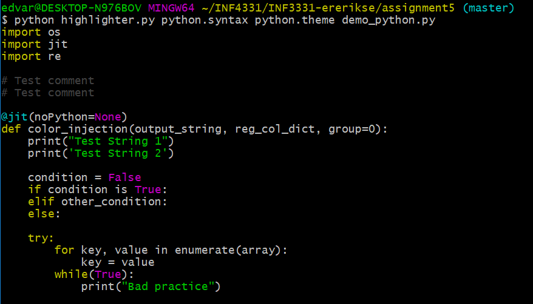

# Assignment 5
This is the directory for Assignment 5, done by Edvarda Eriksen (ererikse) enrolled in INF4331.

## General notice
This repository is on a 3-day extension period due to sickness and is not done yet!

This assignment was solved on a Ubuntu 18.04 system, and has been tested on a Windows 10 WLS system.
## 5.1
Running the script
```
$ python highlighter.py test.syntax test.theme hello.ny
```
A simple example based on the example given in the task.

## 5.2 - Colortheme for Python
Running the demo:
```
$ python highlighter.py python.syntax python.theme demo_python.py

$ python3 highlighter.py python.syntax python2.theme
```
`python.theme` has several different variables colored the same as "normal" syntax highlighting,
while `python2.theme` colors everything differently



**Known issues**:
- I got a strange bug with my try-except RegEx that ruins all other RegExes, 
and I regrettably didn't have the time to fix it


### Comments
```
Full RegEx: #\.*$

#       # A literal #
.*?     # Any character, lazy-notation
$       # End of line
```

### Functions
```
Full RegEx: (\bdef\h+)(?:\w+\h*)(?:\(.*?\):)

(\bdef\h+)      # The def-keyword for functions (group 1)
(?:\w+\h*)      # A plain function name followed by optional whitespace
(?:\(.*?\):)    # Required parantheses with parameters inside
```
Even though as of Python 3 function- and variable names can include more symbols than covered by `\w` as 
[documented here](https://stackoverflow.com/a/19482755), I have decided to stick to the Python 2 allowed characters
for names; letters, digits and underscores, as this is still broadly considered good practice.

Furthermore, due to the complexity of possible variations that can be given as parameters, I have left it as a
`.*?`.


### Strings
```
Full RegEx: \".*?\"|\'.*?\'

\"      # A literal "
.*?     # Any character, lazy-notation
\"      # A literal "
|       # Or
\'      # A literal '
.*?     # Any character, lazy-notation
\'      # A literal '

```

*Additional decisions for comments*:
- The RegEx does not cover triple-quote strings

### Imports
```
Full RegEx: (\bimport\b\h*)(?:\w+\h*)|((\bfrom\b )(?:\w+\h*))

(\bimport\b\h*)     # The import-keyword (group 1)
(?:\w+\h*)          # Any plain name
|                   # Or
((\bfrom\b )        # The from-keyword
(?:\w+\h*))         # Any plain name
```

*Additional decisions for comments*:
- The RegEx does not cover paths, e.g. `import unix_test from tests/unix`

### Special statements
```
Full RegEx: \bTrue\b|\bNone\b|\bFalse\b

\bTrue\b        # Match literally True, case sensitive
|               # Or 
\bNone\b        # Match literally None, case sensitive
|               # Or
\bFalse\b       # Match literally False, case sensitive

```

### Decorators
```
Full RegEx: (\@\w+)(?:\((?:(?:\h*\w+\h*)+[\=,]?)*\))?

(\@\w+)                         # @ aswell as the decorator name (group 1)

(?:                             # Parameter group, zero or one time
    \(                          # Required parameter starting parenthesis (
        (?:                     # Number of parameters, zero or more times
            (?:\h*\w+\h*)+      # Parameter name enclosed in optional whitespace
            [\=,]?              # Followed by an optional = or , sign
        )*
    \)
)?
```
Again the RegEx isn't perfect and can get weird with the parameters, e.g. `@jit(noPython=)` passes.

### try/except
```
Full RegEx: (\btry:\n)|(\bexcept )(?:\w+)(?: as \w+)?(?::)

(\btry:\n)          # The try keyword, followed by a newline (group 1)
|                   # Or
(\bexcept )         # The except keyword (group 2)
    (?:\w+)         # followed by a error name
    (?: as \w+)?    # optionally followed by an "as parameter"
    (?::)           # and closed off with a :

```
As far as I am aware, for a try to succeed programmatically it has to be followed by a 
newline, hence I added it to my RegEx.

### for-loops
```
Full RegEx: (\bfor )(?:\w+(?:\h*,\h*\w+)*?)( in )(?:\w+(?:\.\w+)*)(?:(?:\(.*?\)))*:

(\bfor )                # The for-keyword (group 1)
(?:\w+                  # Parameter to iterate over
    (?:\h*,\h*\w+)*?    # Optional second parameter, e.g. in "for key, value in enumarate"
) 
( in )                  # The in-keyword (group 2)
(?:\w+                  # The data structure being iterated over
    (\.\w+)*            # Optional method call, e.g "file.readlines()"
)         
(?:(?:\(.*?\)))*        # Optional parameters, e.g. range(2, 4)
```

### while-loops
```
Full RegEx: (\bwhile\b\h*)(?:\(\h*)?(?:\w+\h*|\w+\h*(?:==|!=|<>|>|<|>=|<=)\h*\w+)(?:\h*\))?(?::)

(\bwhile\b\h*)              # while key-word with trailing optional horizontal whitespace
(?:\(\h*)?                  # Optional ( and horizontal whitespace before expression
(?:
    \w+\h*                      # Matches a standalone expression, e.g. a parameter "while i"
    |                           # Or
    \w+\h*                      # Matches a plain expresison and optional whitespace ...
        (?:==|!=|<>|>|<|>=|<=)  # Followed by one of these comparators ...
    \h*\w+                      # Followed by optional whitespace and another expression
)                     
(?:\h*\))?                  # Optional whitespace and closing )
(?::)                       # Ended by the needed :
```
All groups after the while-keyword is non-captured as I do not wish to color them, only match them.

*Known problems and additional decisions for while*:
- The RegEx wrongfully matches statements like `while (i>2:`
- The while RegEx does not cover and/or operators, e.g. `while (i>2) and (j<3):`
- The while RegEx does not cover mathematical operators, e.g. `while(i % 2):`

### if/elif/else
```
"(\bif\b|\belif\b|\belse\b)"
```

## 5.3
Not done

## 5.4
```
$ python3 grep.py test3.txt test.syntax
```
or
```
$ python3 grep.py test3.txt test.syntax --highlighter
```

## 5.5
```
$ python3 diff.py text1.txt text2.txt
```

## 5.6 
Again, as the last task was solved in the terminal, this is also solved slightly differently as follows:
```
$ python3 diff_demo.py b.txt diff.syntax diff.theme
```
Here I also decided to handle the lines as the regexes proceeded, and not vice versa, hence first you are presented
all the additions, then the deletions, then the unchanged lines.